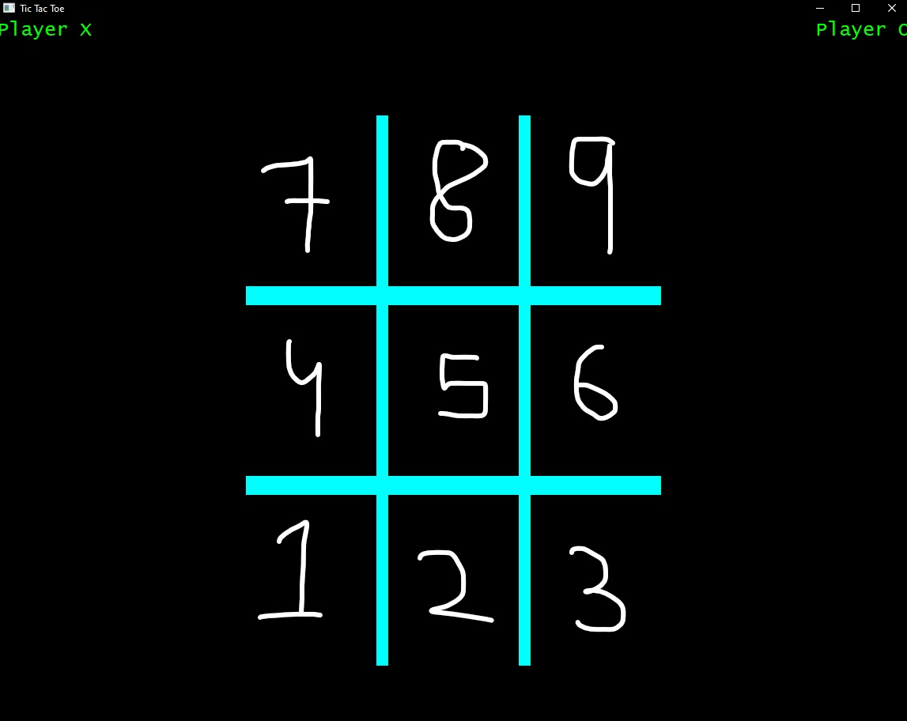
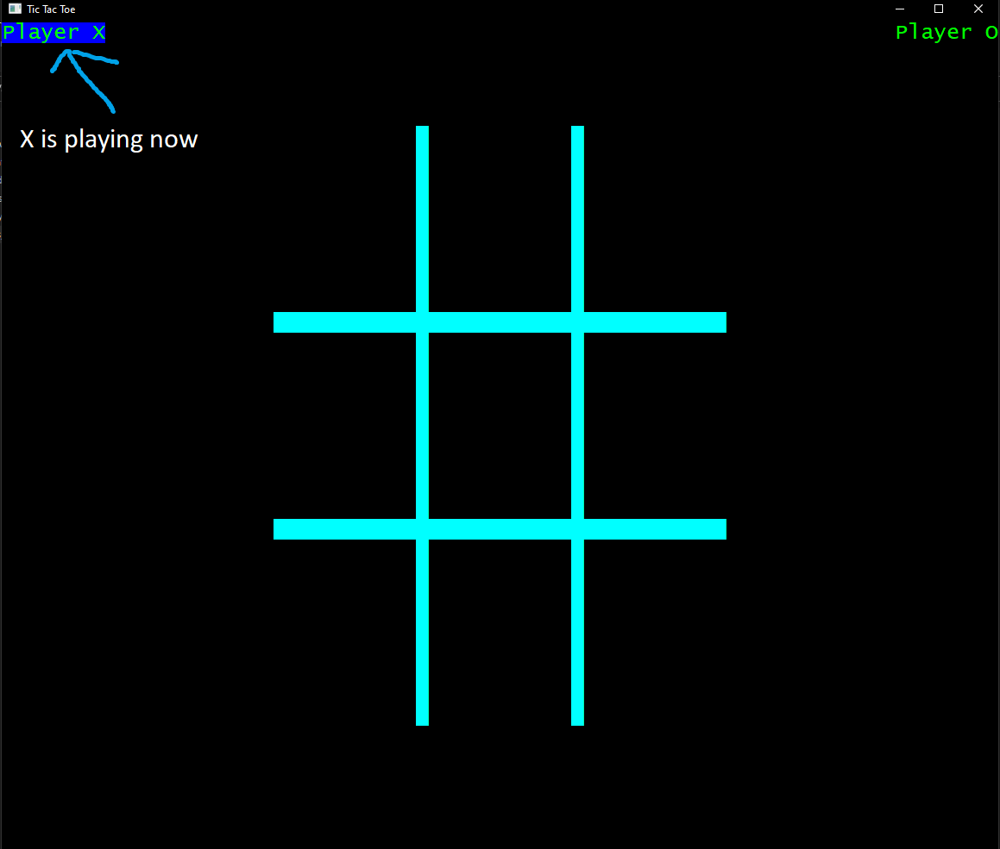
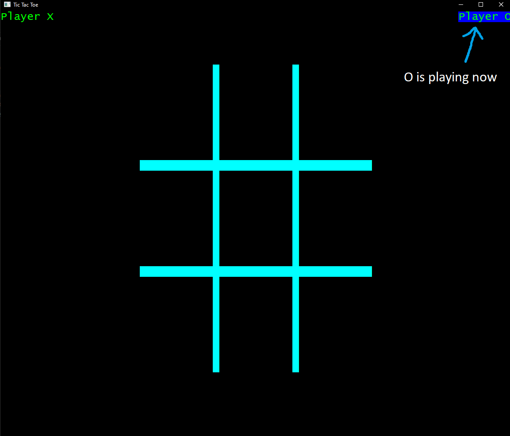

# Tic-Tac-toe

A game that everyone loves to play (you gotta agree on that 😉).

I have been learning C for a year and finally took a step and made my first ever (fun and playable game) TIC TAC TOE or Nots and Crosses if you're from Australia

## Note

I am using the native windows library for this game (windows.h).\
So, if you're a windows user then enjoy the game or else I'll re-do the game again for other platforms too (Mac and linux).

## How to run

Running this game is super simple.\
Just Compile the "Main.c" file using "gcc Main.c -o Main" and run the "Main.exe" file.

## How to play

The game receives input from your keyboard's keypad\Following a layout something like this:

So, pressing the keys 1-9 will put the X or O in their respective position.\
Player names are highlighted with blue background color to indicate the respective player's turn.\
For example.\
\
Here X is playing.\
\
Here player O is playing.\
The game also has some other secret functions too.

## Some secret functions

Pressing the keys SHIFT + X (or in other words entering upper case X) will close the game.\
Pressing the keys SHIFT + R (or in other words entering upper case R) will reset the game (clears the terminal window, and X begins the game).

## Features that'll come in future

There some features that will definitely add in the future

1) An AI playing with the player
2) A main menu.
3) Customizable player names (Note: In AI mode, the AI player will have a default name "Computer")
4) And an Score mode where the game will display a score board showing who lost and who won in each round.
5) The original crossing out feature is not yet implemented 😅. Yeah, I know it sucks without it. But will do that too soon 😁.
